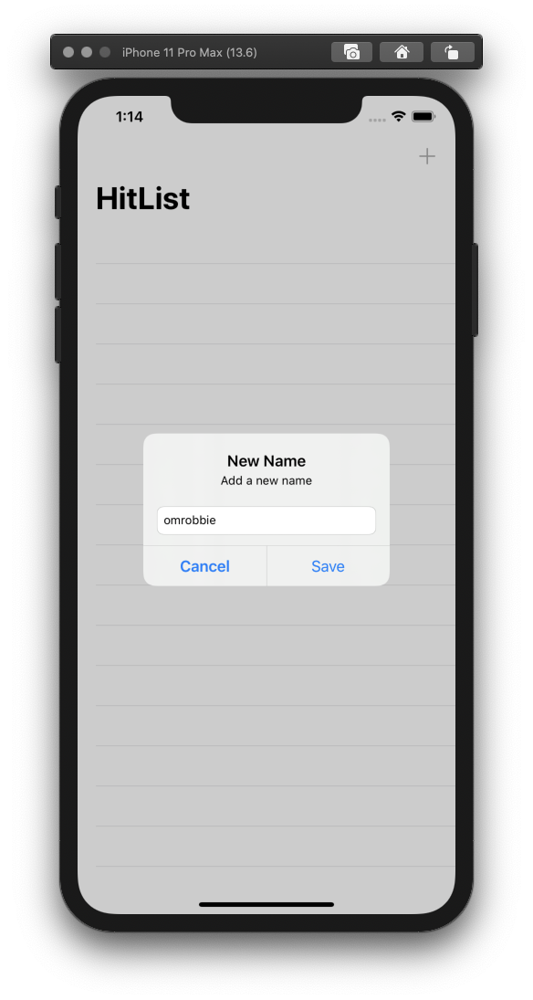
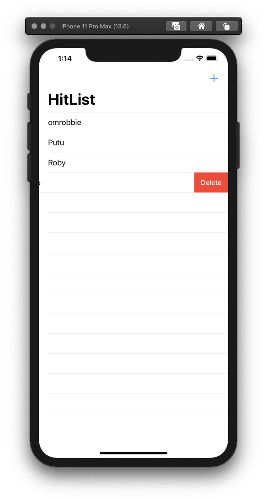

# ios-learn-coredata

### 1. Getting Started with Core Data Tutorial
Learn the basics of building the data layer using Core Data. 
* You can check the full tutorial [here](https://www.raywenderlich.com/7569-getting-started-with-core-data-tutorial). 
&nbsp;
&nbsp;
